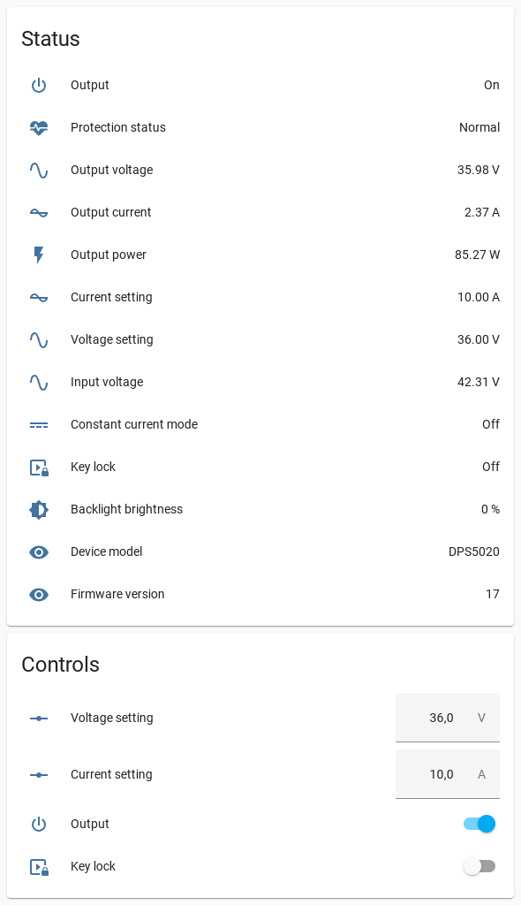
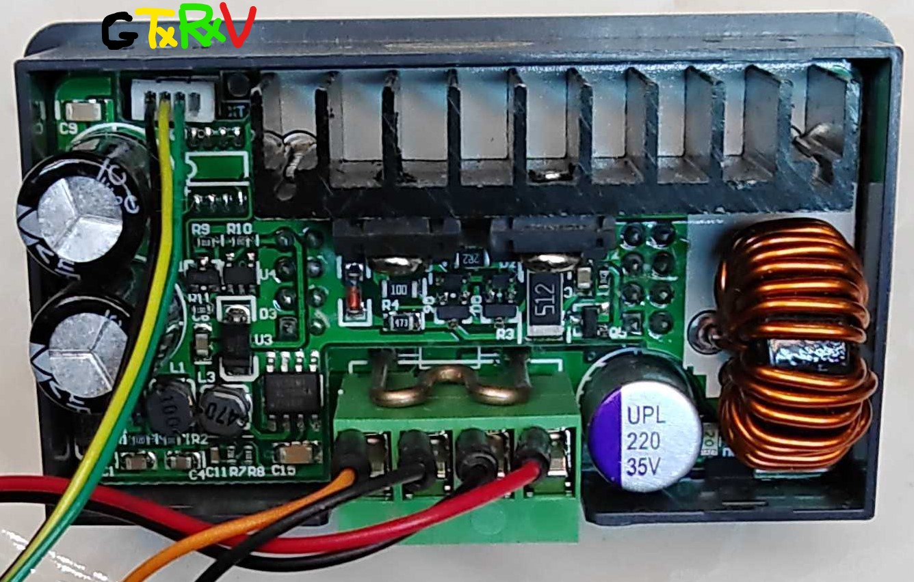

# esphome-dps


[](https://www.buymeacoffee.com/syssi)

ESPHome component to monitor and control the RDTech Digital Control Power Supply (DPS) series via UART-TTL.  



## Supported devices

* DPS3005 Buck, 0-30V, 0-5A, 160W (`current_resolution: HIGH`)
* DPS5005 Buck, 0-50V, 0-5A, 250W (`current_resolution: HIGH`)
* DPS8005 Buck, 0-80V, 0-5.1A, 408W (`current_resolution: HIGH`)
* DPS5015 Buck, 0-50V, 0-15A, 750W (`current_resolution: LOW`)
* DPS5020 Buck, 0-50V, 0-20A, 1000W (`current_resolution: LOW`, tested by [@romeox44](https://github.com/syssi/esphome-dps/discussions/1))
* DPH5005 Buck/Boost, 0-50V, 0-5A, 250W (`current_resolution: HIGH`), reported as model 5205

## Requirements

* [ESPHome 2023.7.0 or higher](https://github.com/esphome/esphome/releases).
* Generic ESP32 or ESP8266 board

## Schematics

```

┌──────────┐                ┌─────────┐
│          │<----- RX ----->│         │
│ DPS5020  │<----- TX ----->│ ESP32/  │
│          │<----- GND ---->│ ESP8266 │<-- 3.3V
│          │                │         │<-- GND
└──────────┘                └─────────┘


│            o GND ── GND                │
│            o TXD ── GPIO5 (`rx_pin`)   │
│            o RXD ── GPIO4 (`tx_pin`)   │
│            o VCC                       │
└─[oooooooo]─────────────────[oooooooo]──┘


```



The connector is a 4 Pin GH Molex Pico 1.25mm. Do not connect the ESP to the VCC pin of the DPS in any case. [This will destroy the voltage regulator of the device](https://tech.scargill.net/dps5020-diy-power-supply/#comment-60544).

## Installation

You can install this component with [ESPHome external components feature](https://esphome.io/components/external_components.html) like this:
```yaml
external_components:
  - source: github://syssi/esphome-dps@main
```

or just use the `esp32-example.yaml` as proof of concept:

```bash
# Install esphome
pip3 install esphome

# Clone this external component
git clone https://github.com/syssi/esphome-dps.git
cd esphome-dps

# Create a secrets.yaml containing some setup specific secrets
cat > secrets.yaml <<EOF
wifi_ssid: MY_WIFI_SSID
wifi_password: MY_WIFI_PASSWORD

mqtt_host: MY_MQTT_HOST
mqtt_username: MY_MQTT_USERNAME
mqtt_password: MY_MQTT_PASSWORD
EOF

# Validate the configuration, create a binary, upload it, and start logs
# If you use a esp8266 run the esp8266-examle.yaml
esphome run esp32-example.yaml
```

## Example response all sensors enabled

```
[D][sensor:124]: 'dps voltage setting': Sending state 36.00000 V with 2 decimals of accuracy
[D][number:012]: 'dps voltage setting': Sending state 36.000000
[D][sensor:124]: 'dps current setting': Sending state 10.00000 A with 2 decimals of accuracy
[D][number:012]: 'dps current setting': Sending state 10.000000
[D][sensor:124]: 'dps output voltage': Sending state 35.98000 V with 2 decimals of accuracy
[D][sensor:124]: 'dps output current': Sending state 2.37000 A with 2 decimals of accuracy
[D][sensor:124]: 'dps output power': Sending state 85.27000 W with 2 decimals of accuracy
[D][sensor:124]: 'dps input voltage': Sending state 42.31000 V with 2 decimals of accuracy
[D][binary_sensor:036]: 'dps key lock': Sending state OFF
[D][switch:037]: 'dps key lock': Sending state OFF
[D][text_sensor:067]: 'dps protection status': Sending state 'Normal'
[D][binary_sensor:036]: 'dps constant current mode': Sending state OFF
[D][binary_sensor:036]: 'dps output': Sending state ON
[D][switch:037]: 'dps output': Sending state ON
[D][sensor:124]: 'dps backlight brightness': Sending state 0.00000 % with 0 decimals of accuracy
[D][text_sensor:067]: 'dps device model': Sending state 'DPS5020'
[D][sensor:124]: 'dps firmware version': Sending state 17.00000  with 0 decimals of accuracy
```

## Known issues

None.

## Debugging

If this component doesn't work out of the box for your device please update your configuration to enable the debug output of the UART component and increase the log level to the see outgoing and incoming serial traffic:

```
logger:
  level: DEBUG

uart:
  id: uart_0
  baud_rate: 9600
  tx_pin: GPIO4
  rx_pin: GPIO5
  debug:
    direction: BOTH
```

## References

* https://sigrok.org/wiki/RDTech_DPS_series
* https://github.com/rfinnie/rdserialtool
* https://github.com/AntaresAdroit/RDTech_PS_Comm
